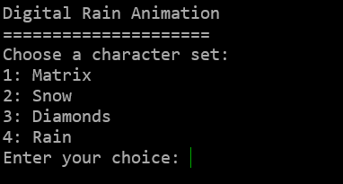
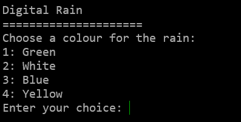

# Digital Rain Animation
A C++ console application that simulates "Digital Rain" much like the iconic "Matrix" falling code effect. Using multithreading, double buffering, and randomization, the program generates cascading streams of Unicode characters that dynamically change and flow down the screen, mimicking the visual style from the Matrix movies.





## Features
- **Realistic Falling Code Effect** – Uses a list-based system to manage individual character streams
- **Dynamic Character Changes** – Each raindrop element has a chance to mutate into a different symbol
- **Adjustable Rain Stream Size** – The length of each stream varies dynamically for a more organic look
- **Custom Unicode Characters** – Uses a selection of unique symbols to enhance the digital rain aesthetic
- **Multiple Character Sets** - Choose between Matrix, Snow, Diamonds, or Rain effects
- **Color Customization** - Select from Green, White, Blue, or Yellow colour schemes
- **Interactive Controls** - Press 'q' to exit the animation and return to menu

## Detailed Code Explanation

### 1. Character Sets and Enums
The program defines different sets of Unicode characters for various visual effects. Each set is carefully chosen to create distinct visual styles:
This set includes mathematical symbols, Greek letters, and special characters that create the classic "Matrix" digital rain look.
```cpp
// Matrix-style characters (default)
const wchar_t unicodeCharacters[]{
    L'Ƣ',L'Ʃ',L'Ʊ',L'Ƹ',L'ǂ',L'ƽ',L'nj',L'Ȣ',L'Ⱦ',L'Ƚ',L'ɑ',L'ɤ',L'ʑ',
    L'ʫ',L'ʥ',L'ʮ',L'λ',L'ε',L'Ϡ',L'Ϟ',L'Ϡ',L'ϰ',L'Є',
    L'ʃ',L'ʘ',L'ʭ',L'ʗ',L'ʡ',L'ʖ',L'ɕ',L'ɺ',L'ɧ',L'ʄ',
    L'β',L'θ',L'ψ',L'ξ',L'ζ',L'ϵ',L'ϑ',
    L'Ж',L'Щ',L'Ѧ',L'Җ',L'Ҩ',L'Ӝ',L'Ԇ',
    L'∑',L'∂',L'∏',L'∩',L'∬',L'⊕',
    L'★',L'♠',L'♣',L'♪',L'♯',L'░',L'▓'
};
```
These characters create a snowflake-like effect.
```cpp
// Snow effect characters
const wchar_t unicodeCharactersSnow[]{
    L'✼',L'❋',L'❊'
};
```
These characters create a simple rain effect using different shades of blocks.
```cpp
// Rain effect characters
const wchar_t unicodeCharactersRain[]{
    L'░',L'▓'
};
```
These characters create a diamond pattern effect.
```cpp
// Diamond effect characters
const wchar_t unicodeCharactersDiamonds[]{
    L'⬖',L'⬗',L'⬘',L'⬙',L'◈'
};
```
The `CharacterSet` enum allows selection between different character sets:
```cpp
enum class CharacterSet {
    Standard,  // Matrix style - uses mathematical and special characters
    Snow,      // Snow effect - uses snowflake-like characters
    Diamonds,  // Diamond shapes - uses diamond and geometric characters
    Rain       // Rain drops - uses block characters
};
```

### 2. Character Set Management
Helper functions to manage character sets:
```cpp
// Returns the appropriate character set based on selection
inline const wchar_t* getCharacterSet(CharacterSet set) {
    switch (set) {
        case matrix::CharacterSet::Standard:
            return unicodeCharacters;      // Return Matrix-style characters
            break;
        case matrix::CharacterSet::Snow:
            return unicodeCharactersSnow;  // Return snow effect characters
            break;
        case matrix::CharacterSet::Diamonds:
            return unicodeCharactersDiamonds; // Return diamond effect characters
            break;
        case matrix::CharacterSet::Rain:
            return unicodeCharactersRain;   // Return rain effect characters
            break;
        default:
            return unicodeCharacters;      // Default to Matrix-style characters
            break;
    }
}
```
### getCharacterSetSize
This gives us the total size in bytes of the entire array. For example, if unicodeCharacters is an array of 50 wchar_t elements
and each wchar_t is 2 bytes (on Windows) then sizeof(unicodeCharacters) would be 100 bytes (50 × 2). sizeof(unicodeCharacters[0]):
This gives us the size in bytes of a single element. In this case, it's the size of one wchar_t, On Windows, this would be 2 bytes. When we divide the total array size by the size of one element. We get the number of elements in the array. This is a safer way to get the array size than manually counting elements because:
It automatically updates if you add or remove elements
It's less prone to errors than manual counting
It works with any array type. [21] [22]
```cpp
// Calculates the size of the selected character set
static size_t getCharacterSetSize(CharacterSet set) {
    switch (set) {
        case matrix::CharacterSet::Standard:
            return sizeof(unicodeCharacters) / sizeof(unicodeCharacters[0]);  // Calculate array size
            
        case matrix::CharacterSet::Snow:
            return sizeof(unicodeCharactersSnow) / sizeof(unicodeCharactersSnow[0]);
            
        case matrix::CharacterSet::Diamonds:
            return sizeof(unicodeCharactersDiamonds) / sizeof(unicodeCharactersDiamonds[0]);
            
        case matrix::CharacterSet::Rain:
            return sizeof(unicodeCharactersRain) / sizeof(unicodeCharactersRain[0]);
            
        default:
            return 0;  // Invalid set returns 0
    }
}
```

### 3. Random Number Generation
The program uses Mersenne Twister for "random" number generation, How Mersenne twister works:

Internal State: Maintains a "memory" (state) of 624 numbers.
Twisting: Periodically scrambles this state using bit shifts and math operations to mix values thoroughly.
Tempering: Further tweaks each output number to hide patterns, ensuring results look random. [16]
The Mersenne Twister is used because it provides better randomization than the standard `rand()` function. The `uniform_int_distribution` ensures an even distribution of random numbers, which is important for the natural look of the animation.

```cpp
static std::random_device rd; // random device to seed MT
static std::mt19937 mt{ rd() };   //Mersenne Twister 19937 https://en.wikipedia.org/wiki/Mersenne_Twister

/*
 rand() % n is biased apparently so using uniform_int_distribution instead.
 https://en.cppreference.com/w/cpp/numeric/random/uniform_real_distribution
*/
static std::uniform_int_distribution<size_t> disI(0, sizeof(unicodeCharacters) / sizeof(unicodeCharacters[0]));
const static size_t maxDepth = 50;  // Maximum depth for rain effect
```

### 4. RainDropElement Structure
Represents a single character in the falling effect:

```cpp
struct RainDropElement {
    const int x, y;  // x,y coords - position in the console
    wchar_t c;       // character - the actual symbol to display
    const wchar_t* charSet;  // character set to use for random changes
    size_t charSetSize;     // size of the character set

    // Randomly changes the character based on probability
    inline void changeRandomly(const float chance) {
        static std::uniform_real_distribution<float> localDisF(0.0f, 1.0f); // rand num 
        if (chance >= localDisF(mt)) {  // If the generated value is less than or equal to chance, change c
            std::uniform_int_distribution<size_t> disI(0, charSetSize - 1); // random index within the range [0, charSetSize - 1]
            c = charSet[disI(mt)]; //picks rand char from charSet
        }
    }

    // Constructor initializes position and character
    inline RainDropElement(const int x, const int y, const wchar_t* charSet, size_t charSetSize)
        : x(x), y(y), c(L' '), charSet(charSet), charSetSize(charSetSize) // Member initializer list
    {
        changeRandomly(1);  // Initialize with a random character
    }
};
```

This structure represents a single character in the falling effect. Each element has:
- Position coordinates (x, y)
- A character to display
- Reference to its character set
- Size of the character set
- A method to randomly change its character

### 5. RainDrop Class
Manages a column of falling characters:

```cpp
class RainDrop {
public:
    using raindrops_t = std::list<RainDropElement>;  // Type alias for list of elements
private:
    raindrops_t rainDropElements;  // falling characters
    const int maxSize;             // maximum size of the column
    int size;                      // current size of the column
    const int x;                   // x position (column position)
    const int maxDepthY;           // screen height
    float changeChance{ 0.5 };     // probability of character change
    int y{ 0 };                    // current y position
    const wchar_t* charSet;        // character set to use
    size_t charSetSize;            // size of character set

public:
    // Constructor initializes the raindrop column
    RainDrop(int maxSize, int x, int maxDepthY, float changeChance, const wchar_t* charSet, size_t charSetSize)
        : maxSize(maxSize), x(x), y(0), size(maxSize / 2), maxDepthY(maxDepthY), changeChance(changeChance),
        charSet(charSet), charSetSize(charSetSize) {
    }

    void fall();  // Updates the falling animation

    // Returns the list of elements in the column
    inline const raindrops_t& get() const {
        return rainDropElements;
    }

    // Increases the size of the column (up to maxSize)
    inline void operator++() {
        size = std::min(maxSize, size + 1);
    }

    // Decreases the size of the column (down to 1)
    inline void operator--() {
        size = std::max(1, size - 1);
    }
};
```

The RainDrop class manages a vertical column of falling characters. It:
- Maintains a list of RainDropElements
- Controls the size of the column
- Handles the falling animation
- Provides methods to modify the column size

### 6. Double Buffered Console
The `DoubleBufferedConsole`[1] class handles efficient screen rendering:
The DoubleBufferedConsole class implements double buffering for smooth screen updates:
- Uses two screen buffers to prevent flickering
- Handles character writing and screen clearing
- Manages console window setup and cleanup
- Supports both Unicode and ASCII characters

### Detailed Explaination of the DoubleBufferedConsole
The `DoubleBufferedConsole` class is designed to provide smooth rendering in the console application by implementing double buffering, a technique that reduces flickering and improves performance by rendering frames off-screen before displaying them. The class DoubleBufferedConsole manages two console screen buffers, switching between them to ensure seamless transitions. Key components include a pair of buffer handles, a `SMALL_RECT` [12] defining the update region, and a dynamically allocated `CHAR_INFO`[13] buffer that stores character and attribute data for the next frame. The constructor initializes these buffers, sets console dimensions, and configures cursor visibility, while the destructor ensures proper cleanup by deallocating memory [26]. The `flip` method swaps the active buffer, copying the prepared frame from the intermediate buffer to the inactive console buffer before making it visible. The `clear` method fills the buffer with a specified character and attribute in this case a white space, while the `write` method updates individual positions, handling both ASCII and Unicode via template specialization. By separating rendering and display operations, the class ensures stable output, making it ideal for applications like games or real-time visualizations where smooth updates are critical. The design leverages Windows Console API functions such as `CreateConsoleScreenBuffer`, `WriteConsoleOutput`, and `SetConsoleActiveScreenBuffer` to manage buffering efficiently, providing solution for high-performance console rendering.

### See References section for the resources used to gain a better understanding of the DoubleBufferedConsole and Windows api. [2]-[14],[21]
```cpp
template<typename char_t = wchar_t>
class DoubleBufferedConsole {
private:
    HANDLE buffer[2]{ nullptr, nullptr };  // Two screen buffers for double buffering
    SMALL_RECT writeRect;                  // Screen region to update
    PCHAR_INFO charInfoBuffer{ nullptr };  // Character buffer
    COORD cursor{ 0,0 }, bufferSize;       // Screen dimensions
    int bufferIndex{ 0 };                  // Current active buffer
    short width, height;                   // Console dimensions

    // Sets up console handlers and initializes the console window
    void handlerSetup(const LPCWSTR title) {
        CONSOLE_CURSOR_INFO cursorInfo;

        for (auto i = 0; i < 2; ++i) {
            // Create and configure screen buffers
            buffer[i] = CreateConsoleScreenBuffer(GENERIC_WRITE, 0, NULL, CONSOLE_TEXTMODE_BUFFER, NULL);
            SetConsoleScreenBufferSize(buffer[i], bufferSize);
            SetConsoleWindowInfo(buffer[i], TRUE, &writeRect);

            if (!buffer[i])
                throw "DoubleBufferedConsole: Handler creation failed!";

            // Hide cursor
            GetConsoleCursorInfo(buffer[i], &cursorInfo);
            cursorInfo.bVisible = false;
            SetConsoleCursorInfo(buffer[i], &cursorInfo);
        }
        SetConsoleTitle(title);
    }

public:
    // Constructor with explicit dimensions
    DoubleBufferedConsole(LPCWSTR title, const short width, const short height)
        : writeRect{0, 0, width,height},
        charInfoBuffer(new CHAR_INFO[width * height]),
        bufferSize{ width,height },
        width(width),
        height(height)
    {
        handlerSetup(title);
    }

    // Constructor using default console size
    DoubleBufferedConsole(const LPCWSTR title, short height = 100)
        :height(height)
    {
        CONSOLE_SCREEN_BUFFER_INFO consoleBufferInfo;
        GetConsoleScreenBufferInfo(GetStdHandle(STD_OUTPUT_HANDLE), &consoleBufferInfo);
        width = consoleBufferInfo.dwSize.X - 1;

        bufferSize = { width,height };
        writeRect = { 0,0,width,height };
        charInfoBuffer = new CHAR_INFO[width * height];
        handlerSetup(title);
    }

    // Destructor cleans up allocated memory
    ~DoubleBufferedConsole() {
        delete[] charInfoBuffer;
        charInfoBuffer = nullptr;
    }

    // Swaps the background buffer to the foreground
    void flip() {
        WriteConsoleOutput(
            buffer[++bufferIndex & 0x01],  // Select next buffer
            charInfoBuffer,                 // Source buffer
            bufferSize,                    // Buffer size
            { 0, 0 },                      // Starting position
            &writeRect);                   // Region to update
        SetConsoleActiveScreenBuffer(buffer[bufferIndex & 0x01]);
    }

    // Clears the background buffer
    void clear(const char_t filling, unsigned short attribute) {
        for (auto y = 0; y < height; ++y) {
            for (auto x = 0; x < width; ++x) {
                charInfoBuffer[x + width * y].Attributes = attribute;
                if constexpr (std::is_same<char_t, wchar_t>::value)
                    charInfoBuffer[x + width * y].Char.UnicodeChar = filling;
                else
                    charInfoBuffer[x + width * y].Char.AsciiChar = filling;
            }
        }
    }

    // Writes a character to the background buffer
    void write(const int x, const int y, const char_t c, unsigned short attribute) {
        const auto coord = x + y * width;
        if constexpr (std::is_same<char_t, wchar_t>::value)
            charInfoBuffer[x + width * y].Char.UnicodeChar = c;
        else
            charInfoBuffer[x + width * y].Char.AsciiChar = c;

        charInfoBuffer[coord].Attributes = attribute;
    }

    // Returns console dimensions
    std::pair<short, short> getSize() const {
        return { width,height };
    }
};
```
### 7. Main Program Flow
The main program handles user interaction and animation:

This shouldExit() function checks for a key press using _kbhit() from the conio.h library[23] and returns true if the 'q' key is pressed, stopping the rain loop and returning to the menu.
```cpp
bool shouldExit()
{
    if (_kbhit())
    {
        return _getch() == 'q';
    }
    return false;
}
```
The initRainDrops function initializes raindrops with random positions and depths using std::mt19937 [21]. It loops through the screen width, creating RainDrop objects with randomized y positions, depths, and characters. Speed is fixed at 0.2f, ensuring smooth animation.
```cpp
static std::random_device rd;
static std::mt19937 mt(rd());

void initRainDrops(std::vector<matrix::RainDrop>& rainDrops, int width, int height, const wchar_t* charSet, size_t charSetSize)
{
    std::uniform_int_distribution<int> disSize(0, height);
    std::uniform_int_distribution<int> disDepth(height, height + height / 2);

    for (int x = 0; x < width; ++x)
    {
        rainDrops.emplace_back(disSize(mt), x, disDepth(mt), 0.2f, charSet, charSetSize);
    }
}
```
Used to clear screen before starting rain loop
```cpp
void clearScreen() {
    system("cls");  // Use system cls instead of newlines
}
```
Prints the menu, user selects the character set to be used for the rain loop.
```cpp
matrix::CharacterSet selectCharacterSet()
{
    clearScreen();
    std::cout << "Digital Rain Animation"<< "\n""====================="<<"\n";
    std::cout << "Choose a character set:\n1: Matrix\n2: Snow\n3: Diamonds\n4: Rain\nEnter your choice: ";

    int choice;
    std::cin >> choice;

    switch (choice)
    {
    case 1: return matrix::CharacterSet::Standard;
    case 2: return matrix::CharacterSet::Snow;
    case 3: return matrix::CharacterSet::Diamonds;
    case 4: return matrix::CharacterSet::Rain;
    default:
        std::cout << "Invalid choice. Please try again.\n";
        std::this_thread::sleep_for(1s);
        return selectCharacterSet();
    }
}
```
Prints menu, user selects the colour of the characters.
```cpp
WORD selectRainColor()
{
    clearScreen();
    std::cout << "Digital Rain" << "\n""=====================" << "\n";
    std::cout << "Choose a colour for the rain:\n1: Green\n2: White\n3: Blue\n4: Yellow\nEnter your choice: ";

    int colourChoice;
    std::cin >> colourChoice;

    switch (colourChoice)
    {
    case 1: return FOREGROUND_GREEN | FOREGROUND_INTENSITY;
    case 2: return FOREGROUND_RED | FOREGROUND_GREEN | FOREGROUND_BLUE | FOREGROUND_INTENSITY;
    case 3: return FOREGROUND_BLUE | FOREGROUND_INTENSITY;
    case 4: return FOREGROUND_RED | FOREGROUND_GREEN | FOREGROUND_INTENSITY;
    default:
        std::cout << "Invalid choice. Defaulting to Green.\n";
        return FOREGROUND_GREEN | FOREGROUND_INTENSITY;
    }
}
```
The `runRainAnimation` function manages the Matrix-style rain animation. It initializes raindrops, updates their positions in a loop, and redraws them on a double-buffered console. It continuously checks for user input (`q` to exit)[23], handles resizing, and refreshes at a set rate.
```cpp
void runRainAnimation(matrix::CharacterSet selectedSet, WORD txtAttributes)
{
    const wchar_t* selectedCharacters = matrix::getCharacterSet(selectedSet);
    size_t selectedCharacterSet = matrix::getCharacterSetSize(selectedSet);

    DoubleBufferedConsole<wchar_t> myConsole(L"Matrix");
    short width, height;
    std::tie(width, height) = myConsole.getSize();

    myConsole.clear(' ', txtAttributes);

    std::vector<matrix::RainDrop> rainDrops;
    initRainDrops(rainDrops, width, height, selectedCharacters, selectedCharacterSet);

    std::uniform_real_distribution<double> disD(0, 1);
    bool running = true;

    while (!shouldExit())  // while should exit is true, is set to false in the shouldExit func when q is pressed
    {
        for (auto& rainDrop : rainDrops)
        {
            rainDrop.fall();
            for (const auto& element : rainDrop.get())
            {
                if (element.y < height)
                {
                    myConsole.write(element.x, element.y, element.c, txtAttributes);
                }
            }

            double randValue = disD(mt);
            if (randValue <= resizeChance)
            {
                (randValue <= 0.5) ? ++rainDrop : --rainDrop;  //new and improved
            }

        }

        myConsole.flip();
        myConsole.clear(' ', txtAttributes);
        std::this_thread::sleep_for(refreshRate);
    }

    std::this_thread::sleep_for(std::chrono::milliseconds(200));
    myConsole.cleanup();
    clearScreen();
}
```
The startRainSimulation function runs an infinite loop where it repeatedly:
Selects a character set for the rain animation.
Selects the rain colour attributes.
Calls runRainAnimation to start the animation with the chosen settings.
It continuously restarts after each animation session.
```cpp
void startRainSimulation()
{
    while (true)
    {
        matrix::CharacterSet selectedSet = selectCharacterSet();
        WORD txtAttributes = selectRainColor();
        runRainAnimation(selectedSet, txtAttributes);
    }
}
```
Here the startRainSimulation function is called in the main loop. To keep main as clean as possible, only one function is called here.
```cpp
int main()
{
    startRainSimulation();
    return 0;
}
}
```
Unit tests [24] [21] [25]
- testRainDropBasics() - A newly created RainDrop should start empty (get().empty()), After calling fall(), the drop should grow by one character (size() == 1).
- testRainDropLimits() - A raindrop with a max size of 5 should not exceed that limit, even after multiple fall() and size-increase (++drop) operations.
- testCharacterSets() - The default character set should not be empty (first character is not a space). The "Snow" set should contain exactly 3 characters.

```cpp
void testRainDropBasics() {
    matrix::RainDrop drop(10, 5, 20, 0.5f, L"AB", 2);

    // Initial state
    assert(drop.get().empty() && "New drop should be empty");

    // Basic falling
    drop.fall();
    assert(drop.get().size() == 1 && "Should add first element");

    std::cout << "testRainDropBasics: OK\n";
}

void testRainDropLimits() {
    matrix::RainDrop drop(5, 0, 10, 0.5f, L"X", 1);

    // Test max size
    for (int i = 0; i < 10; i++) {
        drop.fall();
        ++drop;  // Increase size
    }
    assert(drop.get().size() <= 5 && "Should respect max size");

    std::cout << "testRainDropLimits: OK\n";
}

void testCharacterSets() {
    using namespace matrix;

    // Test default set
    assert(getCharacterSet(CharacterSet::Standard)[0] != L' ' && "Default chars loaded");
    assert(getCharacterSetSize(CharacterSet::Snow) == 3 && "Snow set size correct");

    std::cout << "testCharacterSets: OK\n";
}

void runAllTests() {
    testRainDropBasics();
    testRainDropLimits();
    testCharacterSets();

    std::cout << "\nAll essential tests passed!\n";
}
```

## The main program flow:
1. Displays menu and gets user choices
2. Initializes console and raindrops
3. Runs animation loop
4. Handles user input
5. Updates and renders raindrops
6. Cleans up and returns to menu

## Technical Details
- Uses Windows Console API for efficient screen rendering
- Implements double buffering to prevent screen flicker
- Uses Unicode characters for visual effects
- Employs modern C++ features for efficient memory management
- Provides smooth animation through controlled frame timing
- Uses Mersenne Twister for high-quality random number generation
- Implements efficient memory management with proper cleanup

## Building and Running
1. Compile with a C++17 or later compiler
2. Run the executable in a Windows console
3. Use the menu to select character set and color
4. Press 'q' to exit the animation and return to menu

## Dependencies
- Windows Console API [22]
- C++ Standard Library
- Modern C++ features (C++17 or later)

## Issues
- flickering of rain, at the time I thought this issue was caused by window size being set up incorrectly somehow. The issue fixed itself after maximizing and then minimizing the terminal window. I had tried setting the terminal window to be maxmized on startup, but everything I had tried doesn't seem to work, the fix was changing from C++11 to C++17, not sure how this fixed it yet.
- Originally, I experimented with different console fonts and UTF-16 encoding to display special Unicode characters. However, the console struggled to render them correctly, displaying '?' instead. Using wchar_t arrays with the L prefix worked in displaying Unicode characters correctly.

## Future Improvements
- Remove nested loops from runRainAnimation()

## References
[1] Kevger (2020) DoubleBufferedWindowsConsole. GitHub. Available at: https://github.com/Kevger/DoubleBufferedWindowsConsole/blob/master/source/DoubleBufferedConsole.h

[2] Microsoft (n.d.) CreateConsoleScreenBuffer function. Available at: https://learn.microsoft.com/en-us/windows/console/createconsolescreenbuffer

[3] Microsoft (n.d.) SetConsoleScreenBufferSize function. Available at: https://learn.microsoft.com/en-us/windows/console/setconsolescreenbuffersize

[4] Microsoft (n.d.) SetConsoleWindowInfo function. Available at: https://learn.microsoft.com/en-us/windows/console/setconsolewindowinfo

[5] Microsoft (n.d.) GetConsoleCursorInfo function. Available at: https://learn.microsoft.com/en-us/windows/console/getconsolecursorinfo

[6] Microsoft (n.d.) SetConsoleCursorInfo function. Available at: https://learn.microsoft.com/en-us/windows/console/setconsolecursorinfo

[7] Microsoft (n.d.) SetConsoleTitle function. Available at: https://learn.microsoft.com/en-us/windows/console/setconsoletitle

[8] Microsoft (n.d.) WriteConsoleOutput function. Available at: https://learn.microsoft.com/en-us/windows/console/writeconsoleoutput

[9] Microsoft (n.d.) SetConsoleActiveScreenBuffer function. Available at: https://learn.microsoft.com/en-us/windows/console/setconsoleactivescreenbuffer

[10] Microsoft (n.d.) GetConsoleScreenBufferInfo function. Available at: https://learn.microsoft.com/en-us/windows/console/getconsolescreenbufferinfo

[11] Microsoft (n.d.) HANDLE type. Available at: https://learn.microsoft.com/en-us/windows/win32/winprog/windows-data-types#handle

[12] Microsoft (n.d.) SMALL_RECT structure. Available at: https://learn.microsoft.com/en-us/windows/console/small-rect-str

[13] Microsoft (n.d.) CHAR_INFO structure. Available at: https://learn.microsoft.com/en-us/windows/console/char-info-str

[14] Microsoft (n.d.) COORD structure. Available at: https://learn.microsoft.com/en-us/windows/console/coord-str

[15] cppreference (n.d.) Constructors and member initializer lists. Available at: https://en.cppreference.com/w/cpp/language/constructor

[16] Wikipedia (n.d.) Mersenne Twister. Available at: https://en.wikipedia.org/wiki/Mersenne_Twister

[17] cppreference (n.d.) std::uniform_real_distribution. Available at: https://en.cppreference.com/w/cpp/numeric/random/uniform_real_distribution

[18] cppreference (n.d.) std::tuple. Available at: https://en.cppreference.com/w/cpp/utility/tuple

[19] Microsoft (n.d.) Console screen buffers. Available at: https://learn.microsoft.com/en-us/windows/console/console-screen-buffers

[20] GeeksforGeeks (n.d.) vector::emplace_back in C++ STL. Available at: https://www.geeksforgeeks.org/vectoremplace_back-c-stl/

[21] DeepSeek AI (n.d.) DeepSeek-R1-Lite-Preview. Available at: https://platform.deepseek.com/

[22] https://learn.microsoft.com/en-us/windows/win32/api/

[23] https://en.wikipedia.org/wiki/Conio.h

[24] https://www.geeksforgeeks.org/a-comprehensive-guide-to-unit-testing-in-c/

[25] M. Lynch "Exceptions". Lecture, ATU, Galway, ATU 2025

[26] https://en.cppreference.com/w/cpp/memory/new/operator_delete
