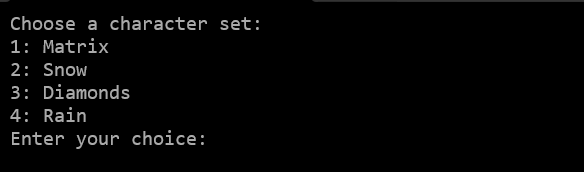

# Digital Rain Animation
A C++ console application that simulates the iconic "Matrix" falling code effect. Using multithreading, double buffering, and randomization, the program generates cascading streams of Unicode characters that dynamically change and flow down the screen, mimicking the visual style from the Matrix movies.




## Features
- **Realistic Falling Code Effect** – Uses a list-based system to manage individual character streams
- **Dynamic Character Changes** – Each raindrop element has a chance to mutate into a different symbol
- **Adjustable Rain Stream Size** – The length of each stream varies dynamically for a more organic look
- **Custom Unicode Characters** – Uses a selection of unique symbols to enhance the digital rain aesthetic
- **Multiple Character Sets** - Choose between Matrix, Snow, Diamonds, or Rain effects
- **Color Customization** - Select from Green, White, Blue, or Yellow color schemes
- **Interactive Controls** - Press 'q' to exit the animation and return to menu

## Detailed Code Explanation

### 1. Character Sets and Enums
The program defines different sets of Unicode characters for various visual effects. Each set is carefully chosen to create distinct visual styles:

```cpp
// Matrix-style characters (default)
const wchar_t unicodeCharacters[]{
    L'Ƣ',L'Ʃ',L'Ʊ',L'Ƹ',L'ǂ',L'ƽ',L'nj',L'Ȣ',L'Ⱦ',L'Ƚ',L'ɑ',L'ɤ',L'ʑ',
    L'ʫ',L'ʥ',L'ʮ',L'λ',L'ε',L'Ϡ',L'Ϟ',L'Ϡ',L'ϰ',L'Є',
    L'ʃ',L'ʘ',L'ʭ',L'ʗ',L'ʡ',L'ʖ',L'ɕ',L'ɺ',L'ɧ',L'ʄ',
    L'β',L'θ',L'ψ',L'ξ',L'ζ',L'ϵ',L'ϑ',
    L'Ж',L'Щ',L'Ѧ',L'Җ',L'Ҩ',L'Ӝ',L'Ԇ',
    L'∑',L'∂',L'∏',L'∩',L'∬',L'⊕',
    L'★',L'♠',L'♣',L'♪',L'♯',L'░',L'▓'
};
```
This set includes mathematical symbols, Greek letters, and special characters that create the classic Matrix "digital rain" look.

```cpp
// Snow effect characters
const wchar_t unicodeCharactersSnow[]{
    L'✼',L'❋',L'❊'
};
```
These characters create a snowflake-like effect.

```cpp
// Rain effect characters
const wchar_t unicodeCharactersRain[]{
    L'░',L'▓'
};
```
These characters create a simple rain effect using different shades of blocks.

```cpp
// Diamond effect characters
const wchar_t unicodeCharactersDiamonds[]{
    L'⬖',L'⬗',L'⬘',L'⬙',L'◈'
};
```
These characters create a diamond pattern effect.

The `CharacterSet` enum allows selection between different character sets:
```cpp
enum class CharacterSet {
    Standard,  // Matrix style - uses mathematical and special characters
    Snow,      // Snow effect - uses snowflake-like characters
    Diamonds,  // Diamond shapes - uses diamond and geometric characters
    Rain       // Rain drops - uses block characters
};
```

### 2. Character Set Management
Helper functions to manage character sets:

```cpp
// Returns the appropriate character set based on selection
inline const wchar_t* getCharacterSet(CharacterSet set) {
    switch (set) {
        case matrix::CharacterSet::Standard:
            return unicodeCharacters;      // Return Matrix-style characters
            break;
        case matrix::CharacterSet::Snow:
            return unicodeCharactersSnow;  // Return snow effect characters
            break;
        case matrix::CharacterSet::Diamonds:
            return unicodeCharactersDiamonds; // Return diamond effect characters
            break;
        case matrix::CharacterSet::Rain:
            return unicodeCharactersRain;   // Return rain effect characters
            break;
        default:
            return unicodeCharacters;      // Default to Matrix-style characters
            break;
    }
}
```

```cpp
// Calculates the size of the selected character set
static size_t getCharacterSetSize(CharacterSet set) {
    switch (set) {
        case matrix::CharacterSet::Standard:
            return sizeof(unicodeCharacters) / sizeof(unicodeCharacters[0]);  // Calculate array size
            
        case matrix::CharacterSet::Snow:
            return sizeof(unicodeCharactersSnow) / sizeof(unicodeCharactersSnow[0]);
            
        case matrix::CharacterSet::Diamonds:
            return sizeof(unicodeCharactersDiamonds) / sizeof(unicodeCharactersDiamonds[0]);
            
        case matrix::CharacterSet::Rain:
            return sizeof(unicodeCharactersRain) / sizeof(unicodeCharactersRain[0]);
            
        default:
            return 0;  // Invalid set returns 0
    }
}
```

### 3. Random Number Generation
The program uses Mersenne Twister for high-quality random number generation:

```cpp
static std::random_device rd; // random device to seed MT
static std::mt19937 mt{ rd() };   //Mersenne Twister 19937 https://en.wikipedia.org/wiki/Mersenne_Twister

/*
 rand() % n is biased apparently so using uniform_int_distribution instead.
 https://en.cppreference.com/w/cpp/numeric/random/uniform_real_distribution
*/
static std::uniform_int_distribution<size_t> disI(0, sizeof(unicodeCharacters) / sizeof(unicodeCharacters[0]));
const static size_t maxDepth = 50;  // Maximum depth for rain effect
```

The Mersenne Twister is used because it provides better randomization than the standard `rand()` function. The `uniform_int_distribution` ensures an even distribution of random numbers, which is important for the natural look of the animation.

### 4. RainDropElement Structure
Represents a single character in the falling effect:

```cpp
struct RainDropElement {
    const int x, y;  // x,y coords - position in the console
    wchar_t c;       // character - the actual symbol to display
    const wchar_t* charSet;  // character set to use for random changes
    size_t charSetSize;     // size of the character set

    // Randomly changes the character based on probability
    inline void changeRandomly(const float chance) {
        static std::uniform_real_distribution<float> localDisF(0.0f, 1.0f); // rand num 
        if (chance >= localDisF(mt)) {  // If the generated value is less than or equal to chance, change c
            std::uniform_int_distribution<size_t> disI(0, charSetSize - 1); // random index within the range [0, charSetSize - 1]
            c = charSet[disI(mt)]; //picks rand char from charSet
        }
    }

    // Constructor initializes position and character
    inline RainDropElement(const int x, const int y, const wchar_t* charSet, size_t charSetSize)
        : x(x), y(y), c(L' '), charSet(charSet), charSetSize(charSetSize) // Member initializer list
    {
        changeRandomly(1);  // Initialize with a random character
    }
};
```

This structure represents a single character in the falling effect. Each element has:
- Position coordinates (x, y)
- A character to display
- Reference to its character set
- Size of the character set
- A method to randomly change its character

### 5. RainDrop Class
Manages a column of falling characters:

```cpp
class RainDrop {
public:
    using raindrops_t = std::list<RainDropElement>;  // Type alias for list of elements
private:
    raindrops_t rainDropElements;  // falling characters
    const int maxSize;             // maximum size of the column
    int size;                      // current size of the column
    const int x;                   // x position (column position)
    const int maxDepthY;           // screen height
    float changeChance{ 0.5 };     // probability of character change
    int y{ 0 };                    // current y position
    const wchar_t* charSet;        // character set to use
    size_t charSetSize;            // size of character set

public:
    // Constructor initializes the raindrop column
    RainDrop(int maxSize, int x, int maxDepthY, float changeChance, const wchar_t* charSet, size_t charSetSize)
        : maxSize(maxSize), x(x), y(0), size(maxSize / 2), maxDepthY(maxDepthY), changeChance(changeChance),
        charSet(charSet), charSetSize(charSetSize) {
    }

    void fall();  // Updates the falling animation

    // Returns the list of elements in the column
    inline const raindrops_t& get() const {
        return rainDropElements;
    }

    // Increases the size of the column (up to maxSize)
    inline void operator++() {
        size = std::min(maxSize, size + 1);
    }

    // Decreases the size of the column (down to 1)
    inline void operator--() {
        size = std::max(1, size - 1);
    }
};
```

The RainDrop class manages a vertical column of falling characters. It:
- Maintains a list of RainDropElements
- Controls the size of the column
- Handles the falling animation
- Provides methods to modify the column size

### 6. Double Buffered Console
The `DoubleBufferedConsole` class handles efficient screen rendering:

```cpp
template<typename char_t = wchar_t>
class DoubleBufferedConsole {
private:
    HANDLE buffer[2]{ nullptr, nullptr };  // Two screen buffers for double buffering
    SMALL_RECT writeRect;                  // Screen region to update
    PCHAR_INFO charInfoBuffer{ nullptr };  // Character buffer
    COORD cursor{ 0,0 }, bufferSize;       // Screen dimensions
    int bufferIndex{ 0 };                  // Current active buffer
    short width, height;                   // Console dimensions

    // Sets up console handlers and initializes the console window
    void handlerSetup(const LPCWSTR title) {
        CONSOLE_CURSOR_INFO cursorInfo;

        for (auto i = 0; i < 2; ++i) {
            // Create and configure screen buffers
            buffer[i] = CreateConsoleScreenBuffer(GENERIC_WRITE, 0, NULL, CONSOLE_TEXTMODE_BUFFER, NULL);
            SetConsoleScreenBufferSize(buffer[i], bufferSize);
            SetConsoleWindowInfo(buffer[i], TRUE, &writeRect);

            if (!buffer[i])
                throw "DoubleBufferedConsole: Handler creation failed!";

            // Hide cursor
            GetConsoleCursorInfo(buffer[i], &cursorInfo);
            cursorInfo.bVisible = false;
            SetConsoleCursorInfo(buffer[i], &cursorInfo);
        }
        SetConsoleTitle(title);
    }

public:
    // Constructor with explicit dimensions
    DoubleBufferedConsole(LPCWSTR title, const short width, const short height)
        : writeRect{0, 0, width,height},
        charInfoBuffer(new CHAR_INFO[width * height]),
        bufferSize{ width,height },
        width(width),
        height(height)
    {
        handlerSetup(title);
    }

    // Constructor using default console size
    DoubleBufferedConsole(const LPCWSTR title, short height = 100)
        :height(height)
    {
        CONSOLE_SCREEN_BUFFER_INFO consoleBufferInfo;
        GetConsoleScreenBufferInfo(GetStdHandle(STD_OUTPUT_HANDLE), &consoleBufferInfo);
        width = consoleBufferInfo.dwSize.X - 1;

        bufferSize = { width,height };
        writeRect = { 0,0,width,height };
        charInfoBuffer = new CHAR_INFO[width * height];
        handlerSetup(title);
    }

    // Destructor cleans up allocated memory
    ~DoubleBufferedConsole() {
        delete[] charInfoBuffer;
        charInfoBuffer = nullptr;
    }

    // Swaps the background buffer to the foreground
    void flip() {
        WriteConsoleOutput(
            buffer[++bufferIndex & 0x01],  // Select next buffer
            charInfoBuffer,                 // Source buffer
            bufferSize,                    // Buffer size
            { 0, 0 },                      // Starting position
            &writeRect);                   // Region to update
        SetConsoleActiveScreenBuffer(buffer[bufferIndex & 0x01]);
    }

    // Clears the background buffer
    void clear(const char_t filling, unsigned short attribute) {
        for (auto y = 0; y < height; ++y) {
            for (auto x = 0; x < width; ++x) {
                charInfoBuffer[x + width * y].Attributes = attribute;
                if constexpr (std::is_same<char_t, wchar_t>::value)
                    charInfoBuffer[x + width * y].Char.UnicodeChar = filling;
                else
                    charInfoBuffer[x + width * y].Char.AsciiChar = filling;
            }
        }
    }

    // Writes a character to the background buffer
    void write(const int x, const int y, const char_t c, unsigned short attribute) {
        const auto coord = x + y * width;
        if constexpr (std::is_same<char_t, wchar_t>::value)
            charInfoBuffer[x + width * y].Char.UnicodeChar = c;
        else
            charInfoBuffer[x + width * y].Char.AsciiChar = c;

        charInfoBuffer[coord].Attributes = attribute;
    }

    // Returns console dimensions
    std::pair<short, short> getSize() const {
        return { width,height };
    }
};
```

The DoubleBufferedConsole class implements double buffering for smooth screen updates:
- Uses two screen buffers to prevent flickering
- Handles character writing and screen clearing
- Manages console window setup and cleanup
- Supports both Unicode and ASCII characters

### 7. Main Program Flow
The main program handles user interaction and animation:

```cpp
int main() {
    while (true) {
        // Display menu and get user choices
        clearScreen();
        std::cout << "Digital Rain Animation\n";
        std::cout << "=====================\n\n";
        std::cout << "Choose a character set:\n";
        std::cout << "1: Matrix\n";
        std::cout << "2: Snow\n";
        std::cout << "3: Diamonds\n";
        std::cout << "4: Rain\n";
        std::cout << "Enter your choice: ";

        // Get character set choice
        int choice;
        std::cin >> choice;
        matrix::CharacterSet selectedSet;
        switch (choice) {
            case 1: selectedSet = matrix::CharacterSet::Standard; break;
            case 2: selectedSet = matrix::CharacterSet::Snow; break;
            case 3: selectedSet = matrix::CharacterSet::Diamonds; break;
            case 4: selectedSet = matrix::CharacterSet::Rain; break;
            default:
                std::cout << "Invalid choice. Please try again.\n";
                std::this_thread::sleep_for(1s);
                continue;
        }

        // Get color choice
        clearScreen();
        std::cout << "Digital Rain Animation\n";
        std::cout << "=====================\n\n";
        std::cout << "Choose a color for the rain:\n";
        std::cout << "1: Green\n";
        std::cout << "2: White\n";
        std::cout << "3: Blue\n";
        std::cout << "4: Yellow\n";
        std::cout << "Enter your choice: ";

        int colorChoice;
        std::cin >> colorChoice;

        // Set color attributes
        WORD txtAttributes = FOREGROUND_GREEN | FOREGROUND_INTENSITY;
        switch (colorChoice) {
            case 1: txtAttributes = FOREGROUND_GREEN | FOREGROUND_INTENSITY; break;
            case 2: txtAttributes = FOREGROUND_RED | FOREGROUND_GREEN | FOREGROUND_BLUE | FOREGROUND_INTENSITY; break;
            case 3: txtAttributes = FOREGROUND_BLUE | FOREGROUND_INTENSITY; break;
            case 4: txtAttributes = FOREGROUND_RED | FOREGROUND_GREEN | FOREGROUND_INTENSITY; break;
            default:
                std::cout << "Invalid choice. Defaulting to Green.\n";
                txtAttributes = FOREGROUND_GREEN | FOREGROUND_INTENSITY;
                break;
        }

        // Initialize console and raindrops
        const wchar_t* selectedCharacters = matrix::getCharacterSet(selectedSet);
        size_t selectedCharacterSet = matrix::getCharacterSetSize(selectedSet);

        DoubleBufferedConsole<wchar_t> myConsole(L"Matrix");
        short width, height;
        std::tie(width, height) = myConsole.getSize();
        myConsole.clear(' ', txtAttributes);

        std::vector<matrix::RainDrop> rainDrops;
        initRainDrops(rainDrops, width, height, selectedCharacters, selectedCharacterSet);

        std::uniform_real_distribution<double> disD(0, 1);

        // Animation loop
        bool running = true;
        while (running) {
            // Check for quit command
            if (_kbhit()) {
                char key = _getch();
                if (key == 'q' || key == 'Q') {
                    running = false;
                    break;
                }
            }

            // Update and render raindrops
            for (auto& rainDrop : rainDrops) {
                rainDrop.fall();
                for (const auto& element : rainDrop.get()) {
                    if (element.y < height) {
                        myConsole.write(element.x, element.y, element.c, txtAttributes);
                    }
                }

                // Randomly adjust raindrop size
                if (disD(mt) <= resizeChance) {
                    if (disD(mt) <= 0.5)
                        ++rainDrop;
                    else
                        --rainDrop;
                }
            }

            // Update screen
            myConsole.flip();
            myConsole.clear(' ', txtAttributes);
            std::this_thread::sleep_for(refreshRate);
        }

        // Cleanup and return to menu
        std::this_thread::sleep_for(std::chrono::milliseconds(200));
        myConsole.~DoubleBufferedConsole();
        clearScreen();
    }

    return 0;
}
```

The main program flow:
1. Displays menu and gets user choices
2. Initializes console and raindrops
3. Runs animation loop
4. Handles user input
5. Updates and renders raindrops
6. Cleans up and returns to menu

## Technical Details
- Uses Windows Console API for efficient screen rendering
- Implements double buffering to prevent screen flicker
- Uses Unicode characters for rich visual effects
- Employs modern C++ features for efficient memory management
- Provides smooth animation through controlled frame timing
- Uses Mersenne Twister for high-quality random number generation
- Implements efficient memory management with proper cleanup

## Building and Running
1. Compile with a C++17 or later compiler
2. Run the executable in a Windows console
3. Use the menu to select character set and color
4. Press 'q' to exit the animation and return to menu

## Dependencies
- Windows Console API
- C++ Standard Library
- Modern C++ features (C++17 or later)
